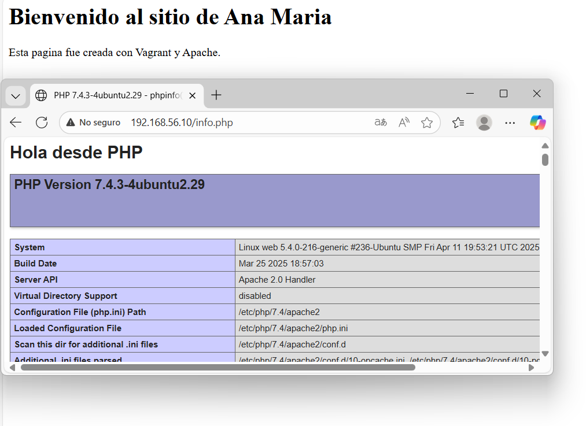
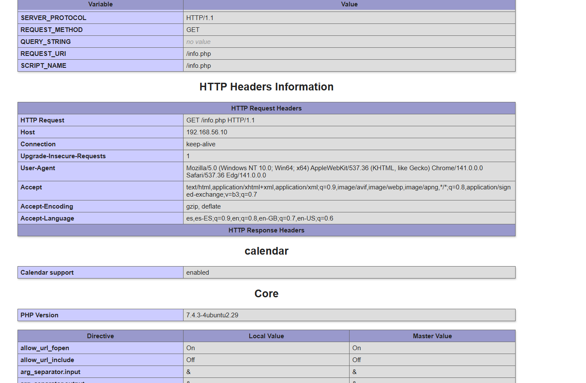
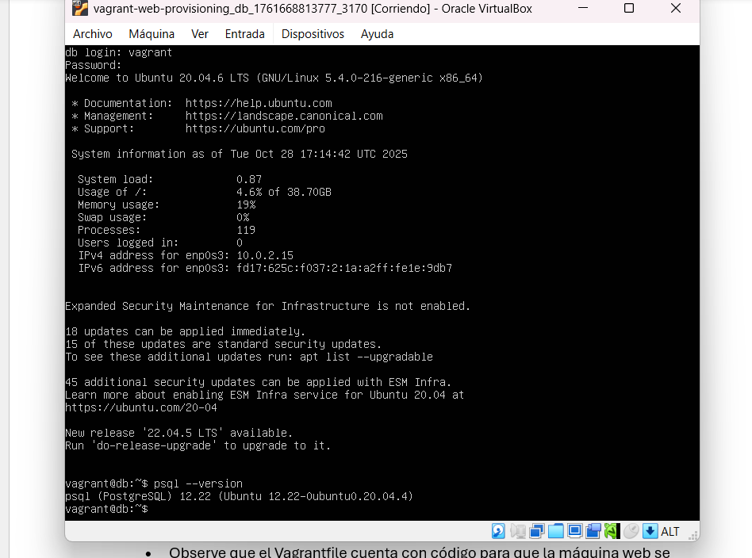

# Taller Vagrant + Provisionamiento con Shell

## Pasos
1. Clonar este repositorio.
2. Ejecutar `vagrant up` para levantar las maquinas.
3. Acceder a la maquina web en: http://192.168.56.10
4. Verificar `index.html` y `info.php`.

## Reto
- Completar `provision-db.sh` para instalar PostgreSQL.
- Crear una base de datos y tabla.
- Conectar la pagina PHP a la base de datos y mostrar datos.
 Pasos de instalacion

A continuacion se muestran capturas del proyecto funcionando:






### 2. Configuración de Vagrant
- El archivo `Vagrantfile` define dos máquinas virtuales:
  - `web`: destinada al servidor web.
  - `db`: destinada a la base de datos.
- Ambas con diferentes direcciones IP privadas.

### 3. Provisionamiento de la máquina web
- El script `provision-web.sh`:
  - Instala **Apache**.
  - Instala **PHP**.
  - Configura Apache para servir contenido desde `/var/www/html`.

### 4. Sitio web en HTML
- Se modifico `index.html` con una página de bienvenida personalizada.
- Se copió a la carpeta compartida del proyecto para desplegarla en `/var/www/html`.

### 5. Script en PHP
- Se creo el archivo `info.php` con el siguiente contenido básico:
  ```php
  <?php
  phpinfo();
  ?>

git add .
git commit -m "Actualizo README y agrego imágenes"
git push

